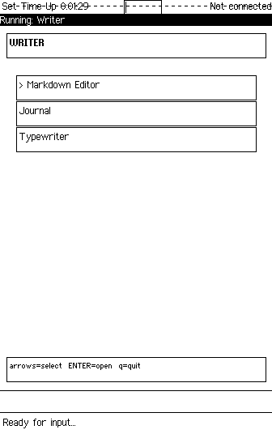
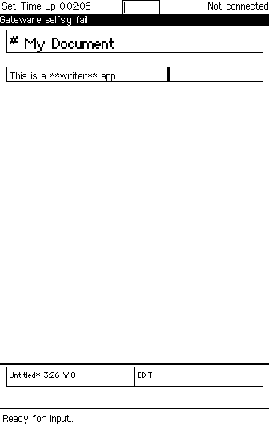
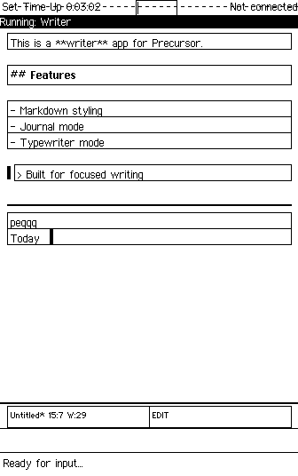
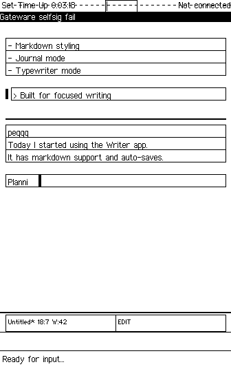

# Writer

A unified writing suite for the [Precursor](https://www.crowdsupply.com/sutajio-kosagi/precursor) device with three modes: Markdown Editor, Journal, and Typewriter.



## Features

### Universal Keys

| Key | Action |
|-----|--------|
| F1 | Menu / Help |
| F4 | Exit / Back |
| F2 | Toggle Preview (in editor) |
| F3 | Save (in editor/journal) |

### Markdown Editor

A multi-document text editor with line-level markdown styling and preview mode.

- **Multi-document management** — create, open, delete documents
- **Line-level syntax styling** in edit mode:
  - Headings → Large/Bold GlyphStyle
  - Code blocks → Monospace GlyphStyle
  - Block quotes → indented with left bar
  - Lists → bullet/number prefix preserved
  - Horizontal rules → drawn line
- **Preview mode** — rendered markdown with stripped prefixes
- **Word/character count** in status bar
- **Export** — TCP push (port 7879) or USB keyboard autotype
- **Auto-save** on exit and focus loss



**Controls (Edit Mode):**
| Key | Action |
|-----|--------|
| Printable chars | Insert at cursor |
| Enter | New line |
| Backspace | Delete backward |
| Arrows | Move cursor |
| Home | Start of line |
| Esc then p | Toggle preview |
| Esc then s | Save document |
| Esc then e | Export menu |
| Esc then f | File menu |
| Esc then q | Back to doc list |

**Controls (Document List):**
| Key | Action |
|-----|--------|
| Enter | Open selected |
| n | New document |
| d | Delete selected |
| Up/Down | Navigate |
| q | Back to mode select |

### Journal

One entry per day, automatically keyed by date with date navigation.

- **Auto-creates today's entry** on open
- **Date navigation** — previous/next day via Esc+[ / Esc+]
- **Auto-saves** on date change or exit
- **Search** across all entries (substring match)
- **Word count** displayed in status bar
- Date sourced from device RTC via `llio::LocalTime`



**Controls:**
| Key | Action |
|-----|--------|
| Printable/Enter/Backspace/Arrows | Edit entry |
| Esc then [ | Previous day |
| Esc then ] | Next day |
| Esc then t | Jump to today |
| Esc then / | Search entries |
| Esc then s | Save current entry |
| Esc then q | Save and back to mode select |

### Typewriter Mode

Full-screen forward-only text entry for free-writing and first drafts.

- **No backspace/delete** — once typed, it stays
- **No cursor movement** — always appends at end
- **Session-based** — starts fresh each time
- **Live word counter** in status bar
- **Session summary** on exit (words, characters, lines)
- **Save option** — transfer session to editor documents



**Controls:**
| Key | Action |
|-----|--------|
| Printable chars | Append at end |
| Enter | New line |
| Esc then d | Done (show summary) |

**Summary Screen:**
| Key | Action |
|-----|--------|
| s | Save as document |
| q | Discard session |

### Export

Export documents via network or USB keyboard.


| Method | Description |
|--------|-------------|
| TCP (port 7879) | Device listens, retrieve with `nc <ip> 7879 > doc.md` |
| USB Keyboard Autotype | Types document character-by-character on connected computer |

## Installation

Clone into your [xous-core](https://github.com/betrusted-io/xous-core) apps directory:

```bash
cd xous-core/apps
git clone https://github.com/tbcolby/precursor-writer.git writer
```

Register the app in your workspace. Add to `xous-core/Cargo.toml` members:

```toml
"apps/writer",
"apps/writer/writer-core",
```

Register in `apps/manifest.json`:

```json
"writer": {
    "context_name": "Writer",
    "menu_name": {
        "appmenu.writer": {
            "en": "Writer",
            "en-tts": "Writer"
        }
    }
}
```

Build and run:

```bash
cargo xtask renode-image writer
```

## Architecture

```
writer-core/            Pure text logic (no Xous deps, host-testable)
src/
  main.rs               Event loop, state machine, key dispatch
  editor.rs             Markdown editor state
  journal.rs            Journal mode (date-keyed entries)
  typewriter.rs         Typewriter mode (append-only)
  render.rs             Drawing: line-by-line with GlyphStyle
  storage.rs            PDDB operations (docs, journal)
  export.rs             TCP push + USB keyboard autotype
  ui.rs                 Shared UI utilities
```

### writer-core Library

The `writer-core` crate provides platform-independent text editing logic, testable on the host:

- `TextBuffer` struct: cursor, viewport scrolling, insert/delete/move operations
- `LineKind` markdown classifier: headings, code blocks, quotes, lists, rules
- `strip_prefix` for preview mode rendering
- Date utilities: epoch ms ↔ YYYY-MM-DD, prev/next day navigation
- Binary serialization for PDDB document storage

Run tests: `cargo test -p writer-core`

### Key Design Decisions

1. **Line-level styling** — One GlyphStyle per TextView. Whole-line classification avoids pixel-level text splitting.

2. **Esc-prefix commands** — All printable characters go to the buffer. Esc followed by one letter triggers commands (similar to vim leader key).

3. **Separate PDDB dictionaries** — `writer.docs` and `writer.journal` keep concerns isolated.

4. **Forward-only typewriter** — Cursor always at end, no editing. Forces free-writing flow.

5. **TCP export** — Simpler than USB mass storage. Proven pattern from other Precursor apps.

### PDDB Storage

All persistent data stored in two dictionaries:

| Dictionary | Key Pattern | Format |
|-----------|-------------|--------|
| writer.docs | `doc_{name}` | Binary: `[u16 title_len][title_utf8][content_utf8]` |
| writer.docs | `_index` | Binary: `[u32 count][u16 name_len][name_utf8]...` |
| writer.journal | `YYYY-MM-DD` | Raw UTF-8 text (entry content) |
| writer.journal | `_index` | Newline-separated list of dates |

## Testing

```bash
# Run writer-core unit tests on host (40 tests)
cargo test -p writer-core

# Build for Renode emulation
cargo xtask renode-image writer
```

## Development

This app was developed using the methodology described in [xous-dev-toolkit](https://github.com/tbcolby/xous-dev-toolkit) — an LLM-assisted approach to Precursor app development on macOS ARM64.

## Author

Made by Tyler Colby — [Colby's Data Movers, LLC](https://colbysdatamovers.com)

Contact: [tyler@colbysdatamovers.com](mailto:tyler@colbysdatamovers.com) | [GitHub Issues](https://github.com/tbcolby/precursor-writer/issues)

## License

Licensed under the Apache License, Version 2.0.
