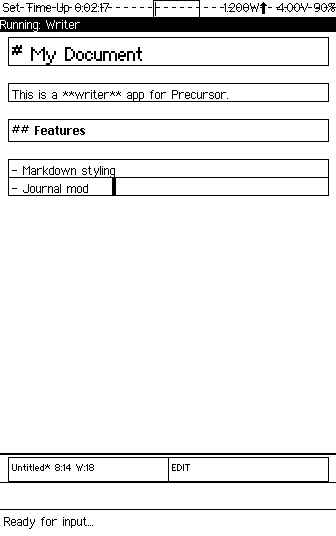

# Writer

**Three relationships with text on a device that keeps your words private.**

```
Writing is thinking made visible.
And thinking should be private.
```

---

## What This Is

Writer is a writing suite for [Precursor](https://precursor.dev) — bunnie Huang's open-source, auditable secure computing handheld. It provides three distinct modes for three distinct acts: a Markdown Editor for revision, a Journal for reflection, and a Typewriter for flow. Each mode embodies a different philosophy of what writing is for. All of them store your words in hardware-encrypted flash. None of them connect to anything.

There is no cloud sync. No collaborative editing. No AI rewriting your sentences. No analytics tracking your word count streaks. Writer is a room with a closed door, a keyboard, and a screen that shows only black and white. What you write there is yours.

---

## Why This Project

Most writing software is built around the assumption that your words should be accessible — from any device, on any network, backed up to someone else's server. The features follow from that assumption: sync, sharing, version history stored in the cloud, AI assistants trained on other people's writing offering to finish your sentences.

But some writing should not be accessible. A journal entry about a difficult day. A first draft so rough you'd be embarrassed if anyone read it. A letter you need to write but may never send. The thinking-out-loud that precedes the polished version. This kind of writing needs a different tool — one that treats privacy not as a feature to be toggled but as a structural guarantee. No network stack in the writing path. No export unless you explicitly choose it. Encryption by default, not by configuration.

Writer exists because the act of writing honestly requires the confidence that no one is reading over your shoulder.

---

## Why Precursor

Precursor is not an obvious platform for a writing tool. The screen is small. The CPU is slow. The display shows only black and white. But every constraint turns out to serve the writing.

**Physical keyboard for real typing.** Precursor has actual keys. Not a glass slab pretending to be keys. You feel the letters. Your fingers learn the shortcuts. Writing on Precursor feels like writing, not like tapping.

**1-bit display eliminates visual distraction.** No color. No font rendering decisions. No syntax highlighting in seventeen shades of purple. The monochrome screen reduces text to its essentials: black marks on a white field. The constraint that sounds most limiting is the one that matters most. A writing tool should show you your words and nothing else.

**PDDB encryption means your journal is private by default.** The Plausibly Deniable DataBase encrypts everything at the storage layer. Your journal entries, your drafts, your typewriter sessions — all encrypted on-device before they touch flash memory. You do not enable encryption. You cannot disable it. Privacy is not a setting. It is the architecture.

**Esc-prefix commands as vim-like muscle memory.** Every printable character goes to your text. Commands live behind a single Esc press followed by one letter — `Esc s` to save, `Esc p` to preview, `Esc q` to quit. No modifier keys to memorize. No menus to navigate. Once the pattern is in your fingers, the interface disappears.

---

## How It Works

### Three Modes for Three Kinds of Writing

The **Markdown Editor** lets you revise — writing as craft, where you shape words until they're right. The **Journal** lets you reflect — writing as mirror, one entry per day, dated and honest. The **Typewriter** lets you flow — writing as movement, forward-only, no backspace, no editing, just the next word.

### Universal Keys

| Key | Action |
|-----|--------|
| F1 | Menu / Help |
| F4 | Exit / Back |
| F2 | Toggle Preview (in editor) |
| F3 | Save (in editor/journal) |

### Settings (Esc Commands — Work in Any Mode)

| Key | Action |
|-----|--------|
| Esc then A | Toggle autosave on/off |
| Esc then L | Toggle line numbers on/off |
| Esc then 0 | Set default mode: Editor |
| Esc then 1 | Set default mode: Journal |
| Esc then 2 | Set default mode: Typewriter |

Settings are automatically persisted to PDDB and restored on app launch.

### Markdown Editor

A multi-document text editor with line-level markdown styling and preview mode.

- **Multi-document management** — create, open, rename, delete documents
- **Line-level syntax styling** in edit mode:
  - Headings -> Large/Bold GlyphStyle
  - Code blocks -> Monospace GlyphStyle
  - Block quotes -> indented with left bar
  - Lists -> bullet/number prefix preserved
  - Horizontal rules -> drawn line
- **Preview mode** — rendered markdown with stripped prefixes
- **Line numbers** — optional, toggle with Esc+L
- **Word/character count** in status bar
- **Export** — TCP push (port 7879) or USB keyboard autotype
- **Auto-save** on exit and focus loss (configurable)

**Controls (Edit Mode):**

| Key | Action |
|-----|--------|
| Printable chars | Insert at cursor |
| Enter | New line |
| Backspace | Delete backward |
| Arrows | Move cursor |
| Home | Start of line |
| Esc then p | Toggle preview |
| Esc then s | Save document |
| Esc then e | Export menu |
| Esc then f | File menu |
| Esc then q | Back to doc list |

**File Menu Options:**

| Option | Description |
|--------|-------------|
| New Document | Save current and create new |
| Rename | Change document name |
| Delete Current | Remove document from PDDB |
| Back to Editor | Return to editing |

**Controls (Document List):**

| Key | Action |
|-----|--------|
| Enter | Open selected |
| n | New document |
| d | Delete selected |
| Up/Down | Navigate |
| q | Back to mode select |

### Journal

One entry per day, automatically keyed by date with date navigation.

- **Auto-creates today's entry** on open
- **Date navigation** — previous/next day via Esc+[ / Esc+]
- **Weekday display** — header shows date and day of week (e.g., "2026-01-23 Thu")
- **Auto-saves** on date change or exit
- **Search with navigation** — find entries by keyword, navigate results with arrows, Enter to jump
- **Word count** displayed in status bar
- Date sourced from device RTC via `llio::LocalTime`

**Controls:**

| Key | Action |
|-----|--------|
| Printable/Enter/Backspace/Arrows | Edit entry |
| Esc then [ | Previous day |
| Esc then ] | Next day |
| Esc then t | Jump to today |
| Esc then / | Search entries |
| Esc then s | Save current entry |
| Esc then q | Save and back to mode select |

**Search Controls:**

| Key | Action |
|-----|--------|
| Type | Enter search query |
| Enter | Execute search (or jump to selected result) |
| Up/Down | Navigate search results |
| Backspace | Delete character |
| F4 | Cancel search |

### Typewriter Mode

Full-screen forward-only text entry for free-writing and first drafts.

- **No backspace/delete** — once typed, it stays
- **No cursor movement** — always appends at end
- **Session-based** — starts fresh each time
- **Live word counter** in status bar
- **Session summary** on exit (words, characters, lines)
- **Save option** — transfer session to editor documents

**Controls:**

| Key | Action |
|-----|--------|
| Printable chars | Append at end |
| Enter | New line |
| Esc then d | Done (show summary) |

**Summary Screen:**

| Key | Action |
|-----|--------|
| s | Save as document |
| q | Discard session |

### Export

Export documents via network or USB keyboard.

| Method | Description |
|--------|-------------|
| TCP (port 7879) | Device listens, retrieve with `nc <ip> 7879 > doc.md` |
| USB Keyboard Autotype | Types document via USB HID keyboard emulation |

**USB Autotype** uses the Xous USB HID API to type your document character-by-character on any connected computer. The device must be connected via USB and recognized as a keyboard. Export is always an explicit, deliberate action — nothing leaves the device without you choosing it.

---

## Technical Architecture

```
writer-core/            Pure text logic (no Xous deps, host-testable)
src/
  main.rs               Event loop, state machine, key dispatch
  editor.rs             Markdown editor state
  journal.rs            Journal mode (date-keyed entries)
  typewriter.rs         Typewriter mode (append-only)
  render.rs             Drawing: line-by-line with GlyphStyle
  storage.rs            PDDB operations (docs, journal, settings)
  export.rs             TCP push + USB HID keyboard autotype
  ui.rs                 Shared UI utilities
```

### writer-core Library

The `writer-core` crate provides platform-independent text editing logic, testable on the host:

- `TextBuffer` struct: cursor, viewport scrolling, insert/delete/move operations
- `LineKind` markdown classifier: headings, code blocks, quotes, lists, rules
- `strip_prefix` for preview mode rendering
- `WriterConfig` for settings persistence
- Date utilities: epoch ms to YYYY-MM-DD, weekday calculation, prev/next day navigation
- Binary serialization for PDDB document and config storage

Run tests: `cargo test -p writer-core`

### Design Decisions

**Line-level styling.** One GlyphStyle per TextView. Whole-line classification avoids pixel-level text splitting. The Precursor display is 336 pixels wide — there is no room for inline formatting complexity. A line is a heading or it is not. A line is code or it is not. The constraint became the design.

**Esc-prefix commands.** Every printable character belongs to the text. Esc followed by one letter triggers commands — similar to vim's leader key pattern. This means you never have to wonder whether a keypress will insert text or execute a command. The boundary is always clear: Esc transitions from writing to commanding. Anything else is writing.

**Separate PDDB dictionaries.** `writer.docs`, `writer.journal`, and `writer.settings` keep concerns isolated. Documents, journal entries, and configuration never collide in the key namespace. Each dictionary can be listed, searched, and managed independently.

**Forward-only typewriter.** Cursor always at end, no editing. This is not a missing feature — it is the feature. The typewriter mode exists to produce text without judgment. Backspace is the enemy of flow. When you cannot delete, you cannot second-guess. You can only write the next word.

**TCP export.** Simpler than USB mass storage. Proven pattern from other Precursor apps. The device opens a TCP listener, you pull with netcat, the connection closes. No protocol negotiation, no driver installation, no file system mounting.

**USB HID autotype.** Uses `usb-device-xous` crate's `send_str()` API for reliable character-by-character keyboard emulation. Connect the Precursor to any computer, trigger export, and the device types your document as if someone were at the keyboard. No drivers, no software installation, no trust required on the receiving machine.

### PDDB Storage Layout

All persistent data stored in three dictionaries:

| Dictionary | Key Pattern | Format |
|-----------|-------------|--------|
| writer.docs | `doc_{name}` | Binary: `[u16 title_len][title_utf8][content_utf8]` |
| writer.docs | `_index` | Binary: `[u32 count][u16 name_len][name_utf8]...` |
| writer.journal | `YYYY-MM-DD` | Raw UTF-8 text (entry content) |
| writer.journal | `_index` | Newline-separated list of dates |
| writer.settings | `config` | Binary: `[u8 default_mode][u8 autosave][u8 show_line_numbers]` |

---

## Building

Writer is a Xous app. It builds as part of the [xous-core](https://github.com/betrusted-io/xous-core) workspace.

### Integration

1. Clone into your xous-core apps directory:

   ```bash
   cd xous-core/apps
   git clone https://github.com/tbcolby/precursor-writer.git writer
   ```

2. Add to workspace `Cargo.toml`:

   ```toml
   "apps/writer",
   "apps/writer/writer-core",
   ```

3. Add to `apps/manifest.json`:

   ```json
   "writer": {
       "context_name": "Writer",
       "menu_name": {
           "appmenu.writer": {
               "en": "Writer",
               "en-tts": "Writer"
           }
       }
   }
   ```

4. Build for Renode emulator:

   ```bash
   cargo xtask renode-image writer
   ```

5. Build for hardware:

   ```bash
   cargo xtask app-image writer
   ```

### Testing

```bash
# Run writer-core unit tests on host (40 tests)
cargo test -p writer-core

# Build for Renode emulation
cargo xtask renode-image writer
```

---

## Screenshots

*Captured via headless Renode emulation on macOS ARM64. The Precursor display is 336x536 pixels, 1-bit monochrome.*

### Three Modes for Three Kinds of Writing

The mode select screen. Editor, Journal, Typewriter — each one a different answer to the question of what writing is for.


### Markdown Editing with Line-Level Syntax Highlighting

The editor in edit mode. Each line is classified by its markdown role and rendered in the corresponding GlyphStyle — headings in Large, code in Monospace, body in Regular. The status bar tracks cursor position, word count, and document name.


### Preview Mode Renders Your Markdown

Toggle preview with Esc+p. Markdown prefixes are stripped, headings are styled, and the document reads as it would in a rendered context. The same content, presented for reading instead of writing.



### One Entry Per Day — Dated, Searchable, Private

The journal opens to today's date. The header shows the day of the week. Navigate backward with Esc+[ and forward with Esc+]. Search across all entries with Esc+/. Every entry is encrypted at rest.


### Forward Only — No Backspace, No Editing, Just Flow

The typewriter mode. There is no cursor to move. There is no text to delete. There is only the next character. The word counter at the bottom is the only metric. When you are done, Esc+d shows a summary and offers to save the session as an editor document.


### Export via TCP Push or USB Keyboard Autotype

Two ways to get text off the device, both requiring deliberate action. TCP opens a listener on port 7879 — pull with netcat. USB autotype types the document character-by-character via HID keyboard emulation. Nothing leaves the device unless you choose it.


---

## Changelog

### v0.2.0

- **USB Autotype now functional** — Uses USB HID API to actually type documents
- **Settings persistence** — Default mode, autosave, line numbers saved to PDDB
- **Line numbers** — Optional display, toggle with Esc+L
- **Document rename** — New option in File menu
- **Journal weekday** — Header shows day of week alongside date
- **Journal search navigation** — Arrow keys to browse results, Enter to jump

### v0.1.0

- Initial release with Editor, Journal, and Typewriter modes

---

## Development
---

This app was developed using the methodology described in [xous-dev-toolkit](https://github.com/tbcolby/xous-dev-toolkit) — an LLM-assisted approach to Precursor app development on macOS ARM64.

## Author
---

Made by Tyler Colby — [Colby's Data Movers, LLC](https://colbysdatamovers.com)

Contact: [tyler@colbysdatamovers.com](mailto:tyler@colbysdatamovers.com) | [GitHub Issues](https://github.com/tbcolby/precursor-writer/issues)

## License
---

Licensed under the Apache License, Version 2.0.

See [LICENSE](LICENSE) for the full text.
